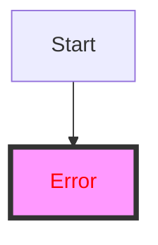

# Color and ANSI Formatting

Standard Markdown does not support text color to ensure content remains semantic and readable across themes (light/dark mode). However, there are workarounds for specific platforms and terminal viewers.

## GitHub Flavored Markdown (Diff Syntax)

You can "fake" colors in GitHub code blocks by using the `diff` language identifier.

```diff
- Red text (Deleted line)
+ Green text (Added line)
! Orange text (Changed line - not supported in all renderers)
# Gray text (Comments)
@@ Purple text (Hunk header) @@
```

**Result:**
```diff
- This line appears red
+ This line appears green
! This might appear orange
# This appears gray
```

## HTML Font Tag (Limited Support)

Some Markdown renderers (like older GitHub wikis or custom implementations) support the HTML `<font>` tag, but **this is generally discouraged** and often stripped out for security.

```html
<font color="red">This text is red</font>
```

*Note: This does NOT work in standard GitHub READMEs.*

## ANSI Escape Codes (Terminal Only)

If your Markdown is intended primarily for the terminal (e.g., displayed via `cat`), you can embed raw ANSI escape codes.

**Warning**: These look like garbage in a web browser or text editor.

```bash
# Red Text
\033[31mHello World\033[0m

# Bold Green Text
\033[1;32mSuccess!\033[0m
```

### Common ANSI Codes

| Color | Foreground | Background |
| :--- | :---: | :---: |
| Black | 30 | 40 |
| Red | 31 | 41 |
| Green | 32 | 42 |
| Yellow | 33 | 43 |
| Blue | 34 | 44 |
| Magenta | 35 | 45 |
| Cyan | 36 | 46 |
| White | 37 | 47 |

## Mermaid Diagrams Styling

You can style nodes in Mermaid diagrams using CSS-like syntax.



````markdown

````

## Best Practices

1.  **Avoid hardcoded colors**: They often break in Dark Mode (e.g., black text on a dark background).
2.  **Use semantic highlighting**: Rely on bold, italic, and code blocks rather than specific colors.
3.  **Test everywhere**: If you must use color hacks, verify them on GitHub, VS Code, and mobile.
