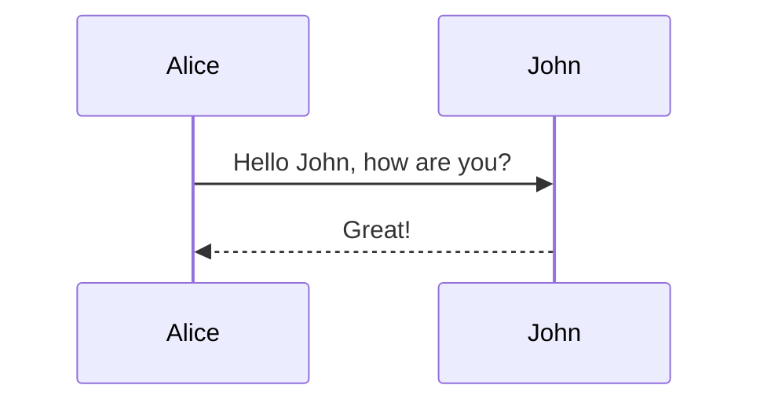

# GitLab Flavored Markdown (GLFM)

GitLab extends standard Markdown with features specifically designed for DevOps and project management.

## Key Features

### 1. Task Lists

Similar to GitHub, GitLab supports task lists.

```markdown
- [x] Completed task
- [ ] Incomplete task
```

### 2. Math Support

GitLab renders math using KaTeX.

```markdown
This formula $a^2 + b^2 = c^2$ is inline.

$$
x = \frac{-b \pm \sqrt{b^2 - 4ac}}{2a}
$$
```

### 3. Mermaid and PlantUML

GitLab supports both Mermaid and PlantUML for diagrams.

#### Mermaid


#### PlantUML
```plantuml
Bob -> Alice : hello
```

### 4. Colors

GitLab supports text color using HTML-like syntax in specific contexts, though standard Markdown is preferred.

```markdown
`#FF0000` (renders a color chip)
```

### 5. Frontmatter

GitLab supports YAML frontmatter for metadata.

```yaml
---
title: My Document
author: GitLab User
---
```

### 6. Table of Contents

Generate a TOC automatically.

```markdown
[[_TOC_]]
```

### 7. Special References

GitLab has extensive quick actions and references:

-   `@user`: Mention a user.
-   `#123`: Issue.
-   `!123`: Merge Request.
-   `$123`: Snippet.
-   `&123`: Epic.
-   `%123`: Milestone.
-   `~label`: Label.

### 8. Collapsible Sections

```markdown
<details>
<summary>Click to expand</summary>

Hidden content here.
</details>
```

### 9. Video and Audio

Embed multimedia directly.

```markdown

```

## Differences from GitHub

-   **Math**: GitLab has native KaTeX support; GitHub uses MathJax.
-   **TOC**: GitLab has a built-in `[[_TOC_]]` tag; GitHub requires manual TOCs or actions.
-   **PlantUML**: Native support in GitLab.

## Resources

-   [GitLab Flavored Markdown](https://docs.gitlab.com/ee/user/markdown.html)
