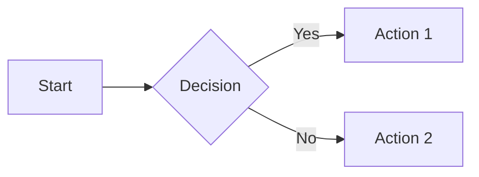

# Obsidian Markdown Support

Obsidian is a powerful knowledge base and note-taking application built on top of local Markdown files. It extends CommonMark with additional features for linking notes, embedding content, and organizing knowledge.

## Overview

Obsidian treats Markdown files as first-class citizens:
- Files stored as plain `.md` on your local filesystem
- Based on CommonMark with Obsidian-specific extensions
- Your data remains portable and accessible outside Obsidian
- Rich plugin ecosystem extends Markdown capabilities

**Philosophy**: Your notes are yours forever, stored in an open format.

## Standard Markdown Support

Obsidian fully supports CommonMark syntax:

### Text Formatting

```markdown
**bold text**
*italic text*
~~strikethrough~~
==highlighted text==
`inline code`
```

### Headings

```markdown
# Heading 1
## Heading 2
### Heading 3
#### Heading 4
##### Heading 5
###### Heading 6
```

All six heading levels are supported.

### Lists

**Bulleted:**
```markdown
- Item 1
- Item 2
  - Nested item
```

**Numbered:**
```markdown
1. First
2. Second
3. Third
```

**Task Lists:**
```markdown
- [ ] Incomplete task
- [x] Completed task
```

### Code Blocks

````markdown
```python
def greet(name):
    return f"Hello, {name}!"
```
````

Obsidian supports syntax highlighting for 100+ languages.

### Tables

```markdown
| Column 1 | Column 2 | Column 3 |
| -------- | -------- | -------- |
| Data 1   | Data 2   | Data 3   |
| Data 4   | Data 5   | Data 6   |
```

Table alignment is supported using colons:
```markdown
| Left | Center | Right |
| :--- | :----: | ----: |
| Text | Text   | Text  |
```

## Obsidian-Specific Features

### Wikilinks

Obsidian's signature feature for linking notes:

```markdown
[[Note Name]]
[[Note Name|Display Text]]
[[Folder/Note Name]]
```

**Benefits:**
- Auto-complete note names
- Create notes on-the-fly by clicking non-existent links
- Rename notes, and links update automatically
- View backlinks to see what links to the current note

**Standard Markdown Alternative:**
```markdown
[Display Text](path/to/note.md)
```

Both formats work in Obsidian, but wikilinks provide better integration.

### Embeds

Embed content from other notes:

```markdown
![[Other Note]]
![[Other Note#Section]]
![[Other Note#^block-id]]
```

**Embed Images:**
```markdown
![[image.png]]
![[image.png|200]]  # with width
![[image.png|200x150]]  # with width and height
```

**Embed PDFs:**
```markdown
![[document.pdf]]
![[document.pdf#page=3]]
```

**Embed Code Blocks from Other Notes:**
```markdown
![[Other Note#^code-block]]
```

### Block References

Link to specific blocks (paragraphs, lists, quotes) within notes:

**Create a block ID:**
```markdown
This is a paragraph. ^block-id
```

**Reference the block:**
```markdown
![[Note Name#^block-id]]
```

### Tags

```markdown
#tag
#nested/tag
#multi-word-tag
```

Tags can appear anywhere in a note and are indexed for search.

**Inline tags:**
```markdown
This paragraph discusses #productivity and #note-taking.
```

**YAML frontmatter tags:**
```yaml
---
tags:
  - productivity
  - note-taking
---
```

### Callouts

Obsidian supports expandable, styled callouts:

```markdown
> [!note]
> This is a note callout.

> [!info]
> This is an info callout.

> [!tip]
> This is a tip callout.

> [!warning]
> This is a warning callout.

> [!danger]
> This is a danger callout.

> [!abstract]
> This is an abstract callout.

> [!quote]
> This is a quote callout.
```

**Collapsible callouts:**
```markdown
> [!note]- Click to expand
> Hidden content

> [!note]+ Click to collapse
> Visible content
```

**Custom callout titles:**
```markdown
> [!tip] Custom Title
> Content here
```

### Footnotes

```markdown
Here's a statement with a footnote.[^1]

[^1]: This is the footnote content.
```

Obsidian supports both inline and reference-style footnotes.

### Comments

```markdown
This is visible text.
%% This is a comment and won't render %%
```

Comments are Obsidian-specific and won't appear in preview or exports.

## Frontmatter (YAML)

Add metadata at the top of notes:

```yaml
---
title: My Note
author: John Doe
date: 2025-11-24
tags:
  - productivity
  - markdown
aliases:
  - Alternative Title
  - Shorthand
---
```

**Common Properties:**
- `title`: Override display name
- `aliases`: Alternative names for linking
- `tags`: List of tags
- `cssclass`: Custom CSS styling
- `publish`: Control publishing behavior
- Custom properties for your workflow

## Advanced Features

### Dataview Query Language

With the Dataview plugin, query your vault using SQL-like syntax:

````markdown
```dataview
TABLE file.ctime as "Created", tags
FROM #project
WHERE status = "active"
SORT file.ctime DESC
```
````

### Mermaid Diagrams


Obsidian renders Mermaid diagrams natively:

````markdown

````

### Math and LaTeX

**Inline math:**
```markdown
The equation $E = mc^2$ is famous.
```

**Block math:**
```markdown
$$
\int_{a}^{b} f(x) dx = F(b) - F(a)
$$
```

Obsidian uses MathJax for rendering.

## Graph View

Obsidian visualizes connections between notes:

- **Local graph**: Shows connections for current note
- **Global graph**: Shows all notes and their connections
- Filter by tags, folders, or link types
- Customize colors and groups

**Markdown Consideration**: Use wikilinks consistently for best graph visualization.

## Vault Organization

### Folder Structure

Organize notes in folders freely:
```
vault/
├── Projects/
│   ├── Project A.md
│   └── Project B.md
├── Notes/
│   ├── Meeting Notes.md
│   └── Ideas.md
└── Resources/
    └── References.md
```

**Link Handling:**
- Obsidian handles relative paths automatically
- Wikilinks work across folders without paths
- Use folders for broad categorization, tags for detailed taxonomy

### Attachments

Store images, PDFs, and other files:
```
vault/
├── attachments/
│   ├── image1.png
│   └── document.pdf
└── notes/
    └── My Note.md
```

Configure attachment folder in Obsidian settings.

## Compatibility and Export

### Compatibility with Other Markdown Tools

**What Works Everywhere:**
- Standard Markdown formatting
- Headings, lists, tables
- Code blocks
- Standard links `[text](url)`
- Images ``

**Obsidian-Specific (May Not Work Elsewhere):**
- Wikilinks `[[note]]`
- Embeds `![[note]]`
- Block references `^block-id`
- Callouts with `[!type]` syntax
- Comments `%%comment%%`
- Tags (though many tools support `#tags`)

### Export Options

**Built-in Export:**
- PDF export (File → Export to PDF)
- Preserves formatting and images

**Publish:**
- Obsidian Publish (paid service)
- Publishes vault to web with full Obsidian features

**Third-Party Tools:**

**jekyll-obsidian**: Convert vault to Jekyll blog
```bash
gem install jekyll-obsidian
```

**obsidian-export**: Export vault to standard Markdown
```bash
cargo install obsidian-export
obsidian-export /path/to/vault /path/to/output
```

**Quartz**: Publish Obsidian vault as static site
```bash
npx quartz create
```

### Conversion to Standard Markdown

To make Obsidian notes portable:

1. **Convert wikilinks to standard links:**
   - `[[Note]]` → `[Note](note.md)`
   - Use plugins or scripts for bulk conversion

2. **Remove Obsidian-specific syntax:**
   - Remove or convert callouts to quotes
   - Remove comments `%%comment%%`
   - Convert block references to direct quotes

3. **Flatten embeds:**
   - Replace `![[note]]` with content from that note
   - Or convert to links

## Plugins and Extensions

Obsidian's plugin ecosystem enhances Markdown capabilities:

### Core Plugins

**Templates**: Insert predefined Markdown templates
**Daily Notes**: Auto-create daily note files
**Outgoing Links**: See all links from current note
**Backlinks**: See all notes linking to current note
**Tag Pane**: Browse all tags in vault

### Community Plugins

**Dataview**: Query and display vault data
**Templater**: Advanced templating with dynamic content
**Excalidraw**: Embed drawings in notes
**Calendar**: Visualize daily notes
**Admonition**: Additional callout types (legacy, prefer native callouts)

## Best Practices

### Linking Strategy

1. **Use wikilinks for internal notes**: Better Obsidian integration
2. **Use standard links for external URLs**: Universal compatibility
3. **Create MOCs (Maps of Content)**: Hub notes linking related content
4. **Use aliases**: Make linking more natural

### Metadata Strategy

1. **Consistent frontmatter**: Define standard properties across vault
2. **Tag taxonomy**: Create hierarchical tag system (`#project/work`, `#project/personal`)
3. **Use properties for filtering**: Enable queries and organization

### Content Strategy

1. **Atomic notes**: One idea per note for better linking
2. **Evergreen notes**: Write notes to be useful long-term
3. **Progressive summarization**: Bold key points for quick review
4. **Link liberally**: Create connections as you write

### Compatibility Strategy

If you need portability:

1. **Prefer standard Markdown**: Use wikilinks sparingly
2. **Document Obsidian features**: Note where you use extensions
3. **Export regularly**: Test your notes in other tools
4. **Use plugins for conversion**: Automate making notes portable

## Comparison with Other Platforms

| Feature | Obsidian | GitHub | Notion |
| --- | --- | --- | --- |
| Local files | ✅ | ✅ | ❌ |
| Wikilinks | ✅ | ❌ | Page links |
| Callouts | ✅ | Alerts | Native blocks |
| Tables | ✅ | ✅ | ✅ |
| Embeds | ✅ | ❌ | ✅ |
| Graph view | ✅ | ❌ | ❌ |
| Plugins | ✅ | ❌ | ❌ |
| Collaboration | Sync/Git | ✅ | ✅ |

## Markdown Rendering Differences

### Live Preview vs. Reading Mode

Obsidian offers two viewing modes:

**Live Preview (default)**: WYSIWYG editing with Markdown syntax visible when editing
**Reading Mode**: Fully rendered view without source visible

**Tip**: Test notes in both modes to ensure proper rendering.

### Custom CSS

Customize Markdown rendering with CSS snippets:

```css
/* .obsidian/snippets/custom.css */
.markdown-preview-view h1 {
    color: #ff6b6b;
    border-bottom: 2px solid #ff6b6b;
}
```

Enable snippets in Settings → Appearance → CSS snippets.

## Resources

- [Obsidian Documentation](https://help.obsidian.md/)
- [Obsidian Markdown Syntax](https://help.obsidian.md/Editing+and+formatting/Basic+formatting+syntax)
- [Obsidian Forum](https://forum.obsidian.md/)
- [Obsidian Plugin Directory](https://obsidian.md/plugins)
- [Obsidian Hub](https://publish.obsidian.md/hub/)
- [CommonMark Spec](https://spec.commonmark.org/)

