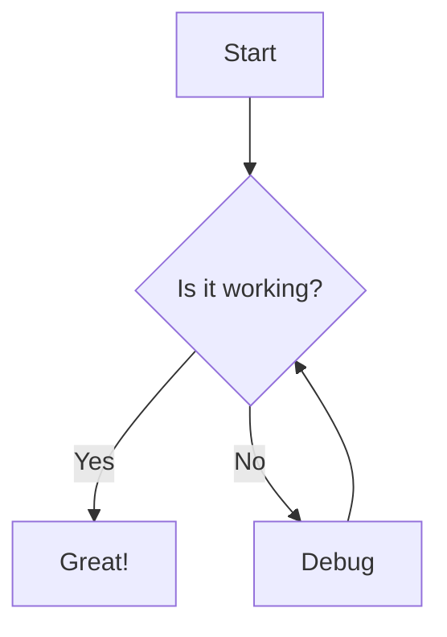

# GitHub Documentation Style Guide

GitHub Flavored Markdown (GFM) extends standard Markdown with features specifically designed for software documentation and project management. This guide covers the essential conventions for creating effective documentation on GitHub.

## Admonitions (Alerts)

GitHub supports distinctive styling for blockquotes to highlight important information.

```markdown
> [!NOTE]
> Useful information that users should know, even when skimming.

> [!TIP]
> Helpful advice for doing things better or more easily.

> [!IMPORTANT]
> Key information users need to know to achieve their goal.

> [!WARNING]
> Urgent info that needs immediate user attention to avoid problems.

> [!CAUTION]
> Advises about risks or negative outcomes of certain actions.
```

## Task Lists

Track progress directly within issues, pull requests, or README files.

```markdown
- [x] Design phase completed
- [ ] Implementation
  - [ ] Core logic
  - [ ] API endpoints
- [ ] Testing
```

## Collapsible Sections

Use HTML `<details>` and `<summary>` tags to hide complex or optional content.

```html
<details>
<summary>Click to expand configuration options</summary>

| Option | Description |
| :--- | :--- |
| `verbose` | Enable verbose logging |
| `debug` | Enable debug mode |

</details>
```

## Syntax Highlighting

Always specify the language identifier for code blocks to enable syntax highlighting.

```markdown
\`\`\`javascript
console.log('Hello, World!');
\`\`\`

\`\`\`python
print("Hello, World!")
\`\`\`
```

## Autolinking

GitHub automatically links certain references:

- **Issues/PRs**: `#123` links to issue/PR number 123.
- **Commits**: `a1b2c3d` links to the specific commit.
- **Users**: `@username` links to the user profile.

## Diagrams (Mermaid)

GitHub supports Mermaid.js for rendering diagrams and charts.



````markdown

````

## Tables

Use tables for structured data, but avoid them for layout.

```markdown
| Header 1 | Header 2 | Header 3 |
| :--- | :---: | ---: |
| Left-aligned | Centered | Right-aligned |
| Item 1 | Item 2 | Item 3 |
```

## Relative Links

Use relative links to navigate between files in the repository. This ensures links work even when the repo is forked or viewed locally.

```markdown
[Contribution Guidelines](../templates/CONTRIBUTING.md)
[Source Code](./src/index.js)
```
