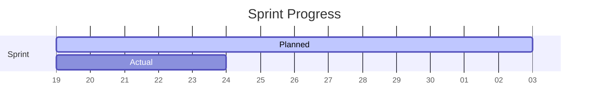

<!-- 
  TEMPLATE: Sprint Board (Kanban)
  COMPLEXITY: Medium
  FEATURES: Task lists, Columns (simulated via headers), Priority indicators
  USE CASE: Managing tasks in a simple, text-based Kanban board.
-->

# 🏃 Sprint 42: "The Answer"

> **Goal**: Ship the new search algorithm and fix critical UI bugs.
> **Dates**: Nov 19 - Dec 03

---

## 📋 Backlog (To Do)

- [ ] **[Feat]** Implement fuzzy search logic `High`
- [ ] **[Design]** Redesign 404 page `Low`
- [ ] **[Docs]** Update API reference for v2 endpoints `Medium`
- [ ] **[Refactor]** Clean up CSS variables in `theme.css` `Low`

---

## 🚧 In Progress

### **[Feat]** Dark Mode Toggle
> Assigned to: **@alex**
- [x] Create toggle component
- [x] Define color tokens
- [ ] Persist preference in local storage

### **[Bug]** Login Timeout
> Assigned to: **@sam**
- [x] Reproduce issue in staging
- [ ] Fix token refresh logic

---

## 🔍 In Review

- [ ] **[Feat]** User Profile Page (#102)
  - *Waiting on design sign-off*
- [ ] **[Fix]** Mobile menu overlap (#99)

---

## ✅ Done

- [x] **[Chore]** Upgrade Node.js to v20
- [x] **[Bug]** Fix typo in landing page
- [x] **[Feat]** Add "Export to PDF" button

---

## 📉 Burndown Status

---

  Sprint Board managed via <a href="#">Markdown</a>

