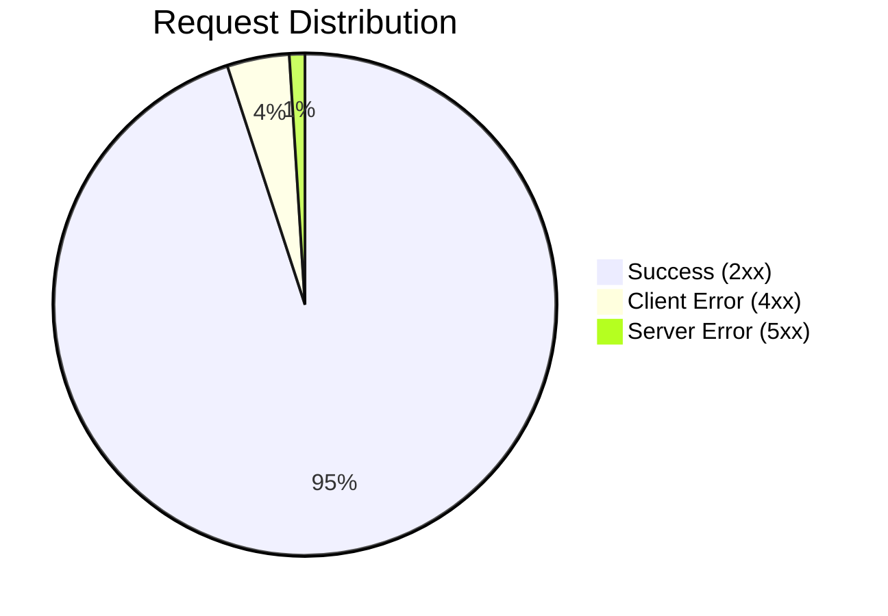

<!-- 
  TEMPLATE: System Status Page
  COMPLEXITY: Medium
  FEATURES: Status indicators, Incident log, Uptime tables
  USE CASE: A lightweight status page hosted on GitHub.
-->

# 🟢 System Status

> **Current Status**: All Systems Operational
> **Last Updated**: 2025-11-19 14:30 UTC

---

## 📡 Service Health

| Service | Status | Uptime (24h) | Latency |
| :--- | :---: | :---: | :---: |
| **API Gateway** | 🟢 Operational | 100% | 45ms |
| **Database (Primary)** | 🟢 Operational | 99.9% | 12ms |
| **Authentication** | 🟡 Degraded | 98.5% | 250ms |
| **Image Processing** | 🟢 Operational | 100% | 1.2s |
| **Webhooks** | 🔴 Outage | 85% | - |

---

## 🔔 Active Incidents

### [Major] Webhook Delivery Failure
**Investigating** - We are currently investigating an issue with webhook delivery failures. Our engineering team is looking into the cause.
*Nov 19, 14:00 UTC*

**Identified** - The issue has been identified as a rate-limiting misconfiguration in our queue service.
*Nov 19, 14:15 UTC*

---

## 📜 Past Incidents

<strong>November 2025</strong>

- **Nov 10**: 🟡 **Database Latency Spike**. Resolved in 15 mins. Caused by bad query.
- **Nov 05**: 🟢 **Scheduled Maintenance**. Completed successfully.

<strong>October 2025</strong>

- **Oct 22**: 🔴 **DDoS Attack**. Mitigated after 1 hour.

---

## 📈 System Metrics (Last 7 Days)

---

  <a href="#">Subscribe to Updates</a> • <a href="#">Support</a>

