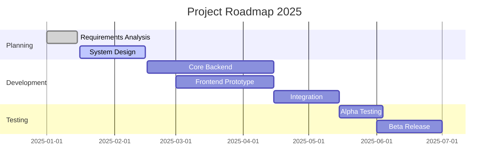
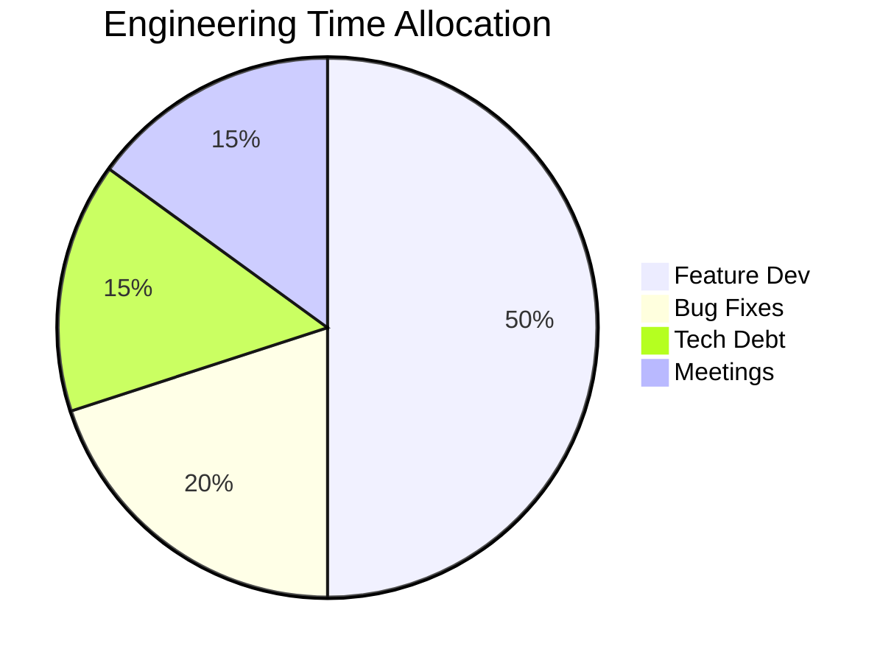

<!-- 
  TEMPLATE: Project Roadmap (Gantt)
  COMPLEXITY: High
  FEATURES: Mermaid.js Gantt Charts, Milestone Tracking, Status Indicators
  USE CASE: Visualizing project timelines and dependencies directly in Markdown.
-->

# 🗺️ Project Roadmap: [Project Name]

> **Status**: 🟢 On Track | **Phase**: Alpha Development | **Next Milestone**: MVP Release (Oct 15)

---

## 📅 Timeline Overview

---

## 🚩 Milestones

### Q1: Foundation
- [x] **M1: Requirements Locked** (Jan 15)
  - All stakeholder interviews completed.
  - Technical specs approved.
- [ ] **M2: Architecture Frozen** (Feb 15)
  - Database schema finalized.
  - API contracts defined.

### Q2: Implementation
- [ ] **M3: Backend Core** (Apr 15)
  - Auth system operational.
  - Data ingestion pipeline running.
- [ ] **M4: Frontend MVP** (May 15)
  - User dashboard functional.
  - Settings page complete.

### Q3: Polish & Launch
- [ ] **M5: Public Beta** (Jul 01)
  - Waitlist invites sent.
  - Monitoring systems active.

---

## 🚦 Risk Register

| Risk ID | Description | Probability | Impact | Mitigation Strategy |
| :---: | :--- | :---: | :---: | :--- |
| **R-01** | API Rate Limits from 3rd party | High | High | Implement aggressive caching and backoff strategy. |
| **R-02** | Mobile UI performance on older devices | Medium | Medium | Test on low-end devices early; optimize React renders. |
| **R-03** | Database migration complexity | Low | High | Run dry-run migrations in staging environment. |

---

## 👥 Resource Allocation

